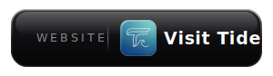

# Tide

  

> A Gmail inbox that's more comfortable and addictive than Gmail itself — with passive AI agents that quietly label, archive, and delete the noise.

## What is Tide?

Tide is a personal, single-user Next.js web app deployed on Vercel. It connects to your Gmail account and gives you a fast, keyboard-driven, thread-grouped inbox (3-pane layout, always-on reading pane, `j`/`k`/`e`/`#`/`l` triage shortcuts, a `⌘K` command palette) — and runs background AI agents that classify unlabeled emails using an LLM (via Google Gemini) and act on your behalf.

You define the rules. The agents do the work. The inbox itself is designed to be the reason you keep coming back.

**Default agents out of the box:**

- **Education Labeler** — labels emails from courses, universities, or learning platforms as `Education`
- **Ads Deleter** — trashes promotional and marketing emails
- **Stale Security Notification Deleter** — removes one-time alerts like "new sign-in detected" or "password changed successfully"

### Contents

- [Prerequisites](#prerequisites)
- [Google Cloud Setup](#google-cloud-setup)
- [Environment Variables](#environment-variables)
- [Development](#development)
- [Deploying](#deploying)
- [Keyboard Shortcuts](#keyboard-shortcuts)
- [Agent Configuration](#agent-configuration)
- [Architecture](#architecture)
- [Privacy](#privacy)
- [Limitations](#limitations)
- [License](#license)

---

## Prerequisites

- **Node.js** ≥ 20
- **A Vercel account** with a KV (Redis) store attached to the project
- **A Google Cloud project** with the Gmail API enabled and a **Web application** OAuth2 client
- **A Gemini API key** (free tier) — get one at [aistudio.google.com/apikey](https://aistudio.google.com/apikey)

---

## Google Cloud Setup

1. Go to [Google Cloud Console](https://console.cloud.google.com) and create/select a project.
2. **APIs & Services → Library** → enable **Gmail API**.
3. **APIs & Services → OAuth consent screen**: choose External, add the scope `https://www.googleapis.com/auth/gmail.modify`, and add your own Gmail address as a test user.
4. **APIs & Services → Credentials → Create Credentials → OAuth client ID**:
   - Application type: **Web application** (not Desktop — this now runs as a real backend)
   - Authorized redirect URIs: `https://<your-vercel-domain>/api/auth/callback` and, for local dev, `http://localhost:3000/api/auth/callback`
5. Copy the **Client ID** and **Client Secret**.

---

## Environment Variables

Copy `.env.example` to `.env.local` and fill in:

```
GOOGLE_CLIENT_ID=
GOOGLE_CLIENT_SECRET=
GEMINI_API_KEY=
GEMINI_MODEL=gemini-2.0-flash   # any Gemini model slug (free tier: gemini-2.0-flash, gemini-2.5-flash-lite)
SESSION_SECRET=            # any long random string
CRON_SECRET=               # any long random string
KV_REST_API_URL=           # from your Vercel KV / Upstash Redis integration
KV_REST_API_TOKEN=
NEXT_PUBLIC_APP_URL=http://localhost:3000
```

In production, set these in the Vercel project's Environment Variables settings — `KV_REST_API_URL`/`KV_REST_API_TOKEN` are auto-injected once you attach a KV store.

---

## Development

```bash
npm install
npm run dev
```

Visit `http://localhost:3000`, click **Connect Gmail**, and your inbox loads.

## Deploying

```bash
vercel deploy
```

`vercel.json` registers a Cron job (`/api/cron`, every 5 minutes) that runs the agent classification cycle. Vercel Hobby plans have historically restricted cron frequency — check your plan's cron limits and relax the schedule in `vercel.json` if needed.

---

## Keyboard Shortcuts

| Key | Action |
| --- | --- |
| `j` / `k` | Navigate rows |
| `Enter` / `o` | Open in reading pane |
| `e` | Archive + advance |
| `#` / `Backspace` | Trash |
| `l` | Quick label |
| `x`, `Shift+j/k` | Multi-select |
| `⌘/Ctrl K` | Command palette |
| `/` | Focus search |
| `g` then `i`/`a`/`t`/`s` | Go to Inbox / Agents / Activity / Settings |
| `?` | Shortcuts cheat sheet |

---

## Agent Configuration

Agents are configured in the **Agents** screen (a slide-over editor with a live preview against your recent inbox). Each agent has:

| Field | Description |
| --- | --- |
| **Name** | Display name for the agent |
| **Prompt** | Natural language instruction — describe what kind of email this agent should handle |
| **Action** | `label`, `archive`, or `delete` |
| **Label** | (Only for `label` action) The Gmail label to apply |
| **Enabled** | Toggle the agent on or off |

Agents default to no-match ("skip") when uncertain — a conservative prompt is safer than an aggressive one.

---

## Architecture

```
┌──────────────────────────────────────────────────────────┐
│  Next.js App Router (Vercel serverless functions)        │
│                                                            │
│  app/api/auth/*     — OAuth2 login/callback/status/logout │
│  app/api/gmail/*    — threads, labels, actions             │
│  app/api/agents/*   — CRUD, run-now, preview, status        │
│  app/api/activity/* — activity log, undo                    │
│  app/api/cron       — Vercel Cron target (agent cycle)      │
│                                                            │
│  lib/gmail/*  — Gmail API (OAuth2Client, threads, actions)│
│  lib/ai/*     — Vercel AI SDK classification (Gemini)     │
│  lib/agents/* — agent defaults + classification runner    │
│                                                            │
│  Vercel KV (Redis) — tokens, agents, activity, settings   │
└──────────────────────────┬─────────────────────────────────┘
                            │ fetch('/api/...')
┌───────────────────────────▼─────────────────────────────────┐
│  React (App Router, client components)                     │
│  3-pane Inbox → Agents → Activity → Settings                │
└──────────────────────────────────────────────────────────────┘
```

**OAuth2 flow:** clicking "Connect Gmail" redirects to Google's consent screen; Google redirects back to `/api/auth/callback`, which exchanges the code for tokens, stores them in Vercel KV, and sets a signed session cookie that gates the rest of the app (this is a single-user deployment — the cookie is a lock on the front door, not a multi-tenant identity system).

**Agent cycle:** every 5 minutes (via Vercel Cron), `/api/cron` fetches up to 100 unlabeled threads, classifies each with Gemini via the Vercel AI SDK, and applies the first matching agent's action. Processed message IDs are tracked in KV to avoid re-classifying. The same cycle can be triggered manually from the UI ("Run Now").

---

## Privacy

- Email content is sent to **Google Gemini** (and whichever model you configure) for classification only.
- OAuth tokens and the Gemini API key never reach the browser — tokens live in Vercel KV, the API key is a server-only environment variable.
- No third-party analytics.

---

## Limitations

- **"Delete" means Trash**, not permanent deletion. Gmail empties Trash after 30 days.
- The agent cycle processes up to **100 unlabeled threads per run**. Large backlogs may take several cycles.
- Vercel Cron frequency is plan-tier dependent — confirm 5-minute cron is available on your plan.
- This is designed for **one user only** — there is no multi-tenant account system.

---

## License

MIT